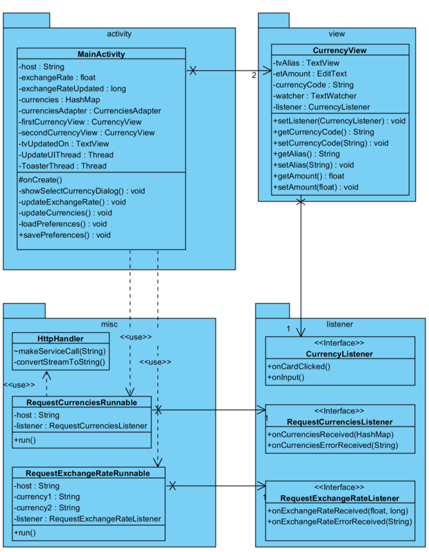

# Cryptocurrency Watcher
Cryptocurrency watcher is an open-source Android application used for converting (crypto)currencies. The app uses an API-service provided by [Cryptonator](https://www.cryptonator.com/api/)

## Features
- Limited Offline Support
  - The latest used currencies and their exchange rates are stored to the phone's memory.
- Dynamic set of currencies
  - The list of currencies is dynamically provided by Cryptonator
  - New currencies wil automatically be added
- Inituative user interface
  - The application is really easy to use. Just insert your value in one the two input fields, and the converted value will automatically be shown.
  
## Demo video
A demo video can be downloaded [here](./docs/demo.mp4)

## Class Diagram

## Product backlog
- As a user, I can select the currencies from a list
- As a user, I can store my preferences (e.g. last used currencies)
- As a user, I can use the app while not being online
- As a user, I can easily fill in my data
